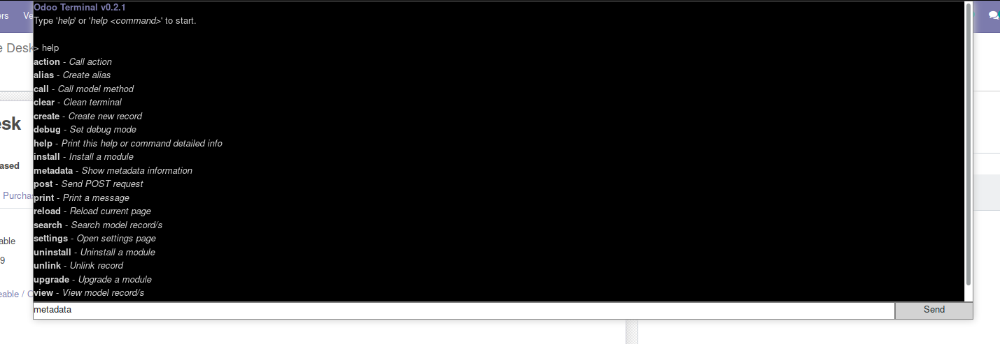

Manage Odoo with commands.

Features
========

* Interactive Terminal
* View models
* Manage records (Create, Read, Update, Delete)
* Manage modules (Install, Upgrade, Uninstall)
* Use alias
* Call model methods
* Launch actions
* Customizable
* And more...

Screenshot
==========

